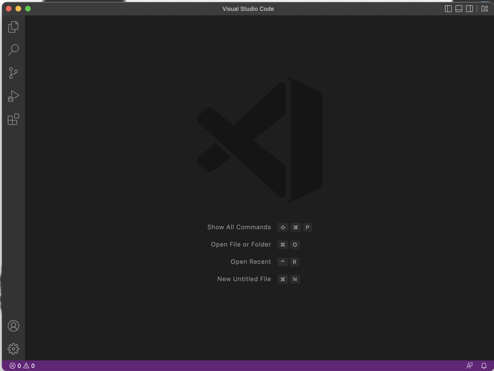
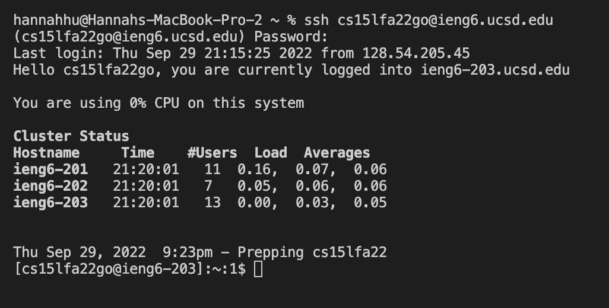
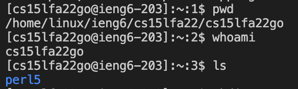
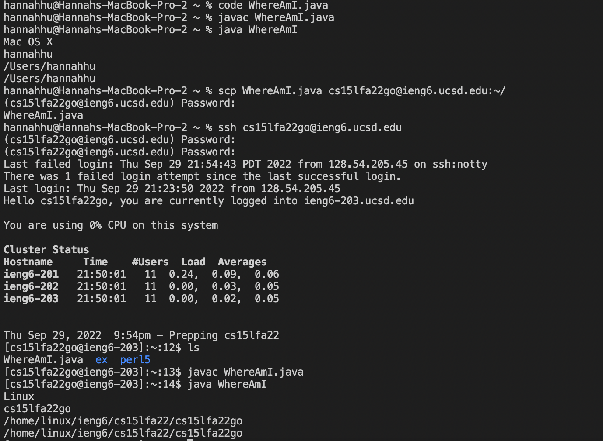

**Step One: Installing VScode

To install VScode, we go to the webstie for it. (https://code.visualstudio.com/)
Choose the right version (MacOs or Windows), and after installing, we can open it which shows this window.

**Step Two: Remotely Connecting

The command ssh enables remote connection. To activate remote connection, use the following command:
ssh {the name of a specific cse 15l account name}@ieng6.ucsd.edu
If it is the first time to log in, we should type "yes" to enable connecting.
After that, enter the password to get access into the account.
We can also see the record for login to the specific remote account.

**Step Three: Trying Some Commands

There are many basic commands that can be used in VScode to control the remote account. The results on the remote computer will be different from our own computer.
Useful commands include the following:
pwd// shows current directory
ls// List all the files and directory 
Mkdir // make/created a new directory 
Cd +(directory name)  // changed current directory 
Cd… //will change your current directory to the parent directory. 
Rm -r // remove directory  

**Step Four: Moving Files with scp

When we write a class with a public static void main class on our own computer, we can use the command scp to copy it into the remote computer.
The structure to use scp is:
scp {name of class}.java {the name of a specific cse 15l account name}@ieng6.ucsd.edu:~/

**Step Five: Setting an SSH Key

When we use the command, ssh-keygen, we can create a key for the remote computer, after which password is not needed for ssh and scp commands.
After the public key is stored in {username}/id_rsa, we use the command, ssh {the name of a specific cse 15l account name}@ieng6.ucsd.edu, and then the command, mkdir .ssh, and then, scp {username}/id_rsa.pub {the name of a specific cse 15l account name}@ieng6.ucsd.edu:~/.ssh/authorized_keys, to activate the key.

